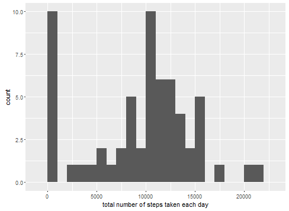
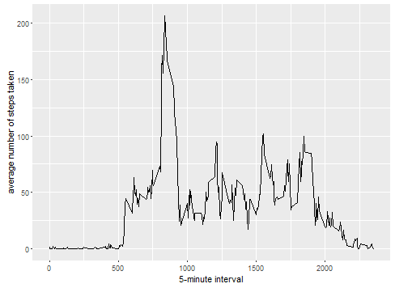
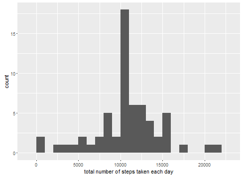
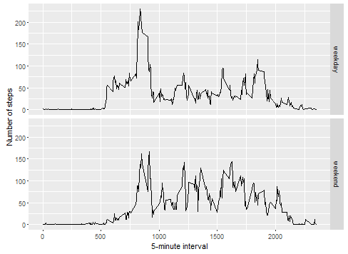

# Reproducible Research: Peer Assessment 1

## Loading and preprocessing the data

```r
unzip(zipfile = "activity.zip")
data <- read.csv("activity.csv")
```


## What is mean total number of steps taken per day?

```r
library(ggplot2)
total.steps <- tapply(data$steps, data$date, FUN = sum, na.rm = TRUE)
qplot(total.steps, binwidth = 1000, xlab = "total number of steps taken each day")
```

 

```r
mean(total.steps, na.rm = TRUE)
```

```
## [1] 9354
```

```r
median(total.steps, na.rm = TRUE)
```

```
## [1] 10395
```


## What is the average daily activity pattern?

```r
library(ggplot2)
averages <- aggregate(x = list(steps = data$steps), by = list(interval = data$interval), 
    FUN = mean, na.rm = TRUE)
ggplot(data = averages, aes(x = interval, y = steps)) + geom_line() + xlab("5-minute interval") + 
    ylab("average number of steps taken")
```

 


On average across all the days in the dataset, the 5-minute interval contains
the maximum number of steps?

```r
averages[which.max(averages$steps), ]
```

```
##     interval steps
## 104      835 206.2
```


## Imputing missing values

the total number of missing values in the dataset (i.e. the total number of rows with NAs)

```r
missing <- is.na(data$steps)
table(missing)
```

```
## missing
## FALSE  TRUE 
## 15264  2304
```


All of the missing values are filled in with mean value for that 5-minute
interval.


```r
# Replace each missing value with the mean value of its 5-minute interval
fill.value <- function(steps, interval) {
    filled <- NA
    if (!is.na(steps)) 
        filled <- c(steps) else filled <- (averages[averages$interval == interval, "steps"])
    return(filled)
}
filled.data <- data
filled.data$steps <- mapply(fill.value, filled.data$steps, filled.data$interval)
```

Now make a histogram of the total number of steps taken each day and calculate the mean and median total number of steps taken per day.


```r
total.steps <- tapply(filled.data$steps, filled.data$date, FUN = sum)
qplot(total.steps, binwidth = 1000, xlab = "total number of steps taken each day")
```

 

```r
mean(total.steps)
```

```
## [1] 10766
```

```r
median(total.steps)
```

```
## [1] 10766
```

## Are there differences in activity patterns between weekdays and weekends?
First, let's find the day of the week for each measurement in the dataset. In
this part, we use the dataset with the filled-in values.


```r
weekday.or.weekend <- function(date) {
    day <- weekdays(date)
    if (day %in% c("Monday", "Tuesday", "Wednesday", "Thursday", "Friday")) 
        return("weekday") else if (day %in% c("Saturday", "Sunday")) 
        return("weekend") else stop("invalid date")
}
filled.data$date <- as.Date(filled.data$date)
filled.data$day <- sapply(filled.data$date, FUN = weekday.or.weekend)
```


Make a panel plot containing a time series plot (i.e. type = "l") of the 5-minute interval (x-axis) and the average number of steps taken, averaged across all weekday days or weekend days (y-axis).

```r
averages <- aggregate(steps ~ interval + day, data = filled.data, mean)
ggplot(averages, aes(interval, steps)) + geom_line() + facet_grid(day ~ .) + 
    xlab("5-minute interval") + ylab("Number of steps")
```

 

